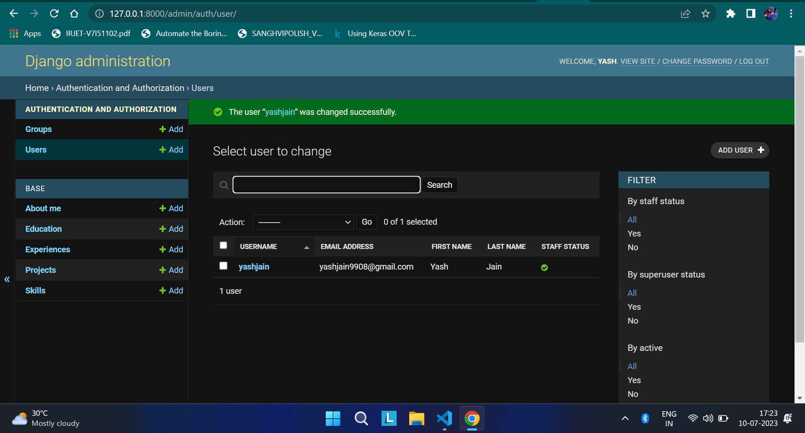

# portfolio-yashjain
> My Portfolio, created using Django

You can see the Project here [portfolio-yashjain](https://portfolio-yashjain.herokuapp.com)

Also you can similar site for you by making customization through **Admin Panel**

<!-- Admin Panel image -->


You will be required to have python installed in your device. After that you can follow the below steps

**Create a `virtualenv`** for this project to run in isolation

**Step 1:** To Check if virtual environment is present type this code in cmd
```
virtualenv --version
```

**Step 2:** If you are able to see **version** you can skip this step. If not please execute this command in cmd
```
pip install virtualenv
```
Now execute `Step 1` to verify your install.

**Step 3:** To Create Virtual Environment execute the below command

First navigate to the folder in which you want to create environment and run the project. Example
```
cd Documents/portfolio_code
```

>`port` is the name of environment, please change it according to you preferences
```
python -m venv port
```
To activate the environment we need to execute this command
```
./port/Scripts/activate
```

**Step 4:** Now we need to clone this repository. Execute the below code for this
```
git clone https://github.com/yashhjaiin/portfolio-yashjain
```

>After the repository is cloned. Navigate to the newly created repository folder by
```
cd portfolio-yashjain
```

**Step 5:** Now execute this command to download packages needed for this app to run.
```
pip install -r requirements.txt
```

**Step 6:** Create a superuser and password
```
python manage.py createsuperuser
```
You will be prompted to enter
>Username (leave blank to use 'yashj'): yashjain
>
>Email address: yashjain9908@gmail.com
>
>Password:
>
>Password (again):
>
>Superuser created successfully.

**Step 7:** To run the app we need to execute this command
```
python manage.py runserver
```
### Finally Now go to admin section and login by the credentials provided while creating `superuser`

Go to users tab and delete other users to avoid issues. You can refer to [How to clone and run Django App](https://www.geeksforgeeks.org/clone-and-run-a-django-project-from-github/) for more detailed explanation.

Created with :heart: by Yash Jain. Thank You :relieved:
